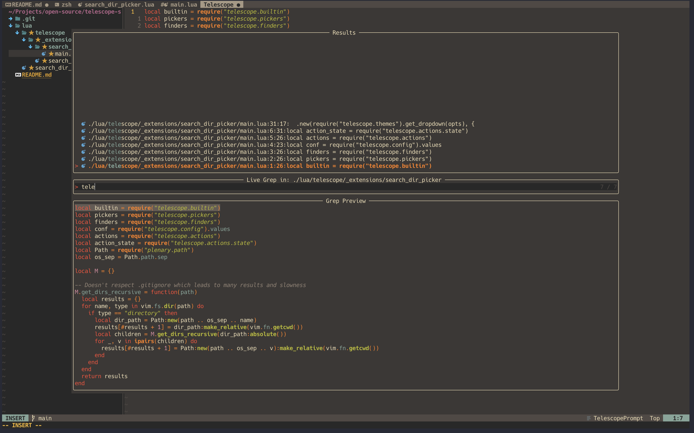

# telescope-search-dir-picker

This plugin adds the ability to interactively choose directory for builtin [Telescope](https://github.com/nvim-telescope/telescope.nvim) pickers.

At the moment of writing, only supported builtin picker is `live_grep`.




## Requirements

- [telescope.nvim](https://github.com/nvim-telescope/telescope.nvim) (required)
- [plenary.nvim](nvim-lua/plenary.nvim) (required)
- [tree](https://formulae.brew.sh/formula/tree#default) (required)

## Setup

Install the plugin using your favourite package manager.

```lua
use("smilovanovic/telescope-search-dir-picker.nvim")
```

Then, you need to tell Telescope about this extension somewhere after your
`require('telescope').setup()`, by calling:

```lua
require('telescope').load_extension('search_dir_picker')
```

## Usage

```lua
require('search_dir_picker').search_dir()
```

or

```vim
:Telescope search_dir_picker
```

## Help!

Is there something not quite right or could be improved? Log an issue with a
minimal reproduction, or better yet, raise a PR.
